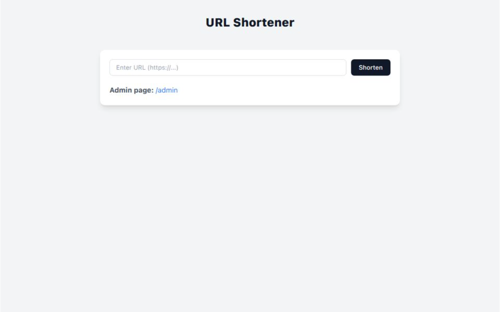

<h1 align="center" style="color:#2c3e50;">🧠 URL Shortener</h1>

<p align="center">
  
</p>

<p align="center">
  <b>This is the frontend for the MERN URL Shortener application.  
Built with React, it allows users to submit long URLs, receive shortened links, and (optionally) log in to the admin page to manage all URLs.
  </b>
</p>


---

## 🌟Features

- Form to submit a long URL.
- Displays the shortened URL after submission.
- Click to copy the shortened link.
- **Admin-only page**:
  - View all shortened URLs.
  - See click counts and last visited time.
  - Delete URLs.
    
---

## 🛠️ Tech Stack

> This repository contains the **full-stack application**.

- **React.js** – UI library
- **Vite** – Fast development bundler
- **Fetch API** – For backend communication
- **Tailwind CSS / Custom CSS** – Styling
- **React Hooks** – State management


---

## 🚀 Live Demo

🌐 **App Link :**  https://url-shortener-frontend-chi-seven.vercel.app

---
## 🖥 Usage
### User Page
- Enter a long URL.

- Click Shorten.

- Copy the generated shortened link.

### Admin Page
- Navigate to /admin.

- Enter the admin password (same as ADMIN_PASSWORD from backend .env).

- View, delete, and manage URLs.

### 🔗 API Integration
#### The frontend communicates with the backend API:

- POST /api/shorten – Create short URL.

- GET /api/admin/urls – Admin list.

- DELETE /api/admin/urls/:shortcode – Delete URL.

---

## 📁 Project Structure
```bash
frontend/
│
├── src/
│ ├── pages/
│ │ ├── Home.jsx
│ │ ├── Admin.jsx
│ ├── App.jsx
│ ├── main.jsx
│ └── styles.css
├── public/
├── .env.example
├── package.json
└── vite.config.js
```
---

## ⚙️ Getting Started
1️⃣ Clone the Repository
```
git clone https://github.com/rockyhans/URL-Shortener-Frontend
cd frontend
```


---

## ⚙️ Environment Variables

Create a `.env` file in the frontend root:

```env
VITE_API_BASE_URL=http://localhost:5000
```

3️⃣ Install Dependencies

```
cd app
npm install
```
App will be running at:
<br>
Frontend → http://localhost:5143

---

👤 Contributors
<table> <tr> <td align="center">  <br /><sub><b>Danish Rizwan</b></sub><br /> <sub>Full-Stack Developer</sub> </td> </tr> </table>
📬 Contact
<br>
📧 Email: rdanishrizwan@example.com
<br>

